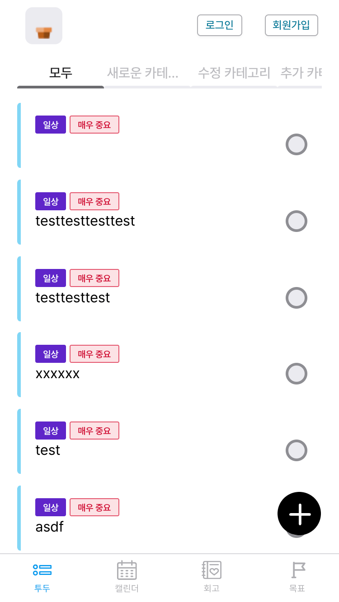

  

<h1 align="middle"><a href="https://teo-sprint-12-todo.github.io/teo-todo-frontend/#/mainTodoList">투두뚜두</a></h1>

## 💬 서비스 소개

`투두뚜두`는 여러분의 목표 달성을 도와주는 투두리스트 웹앱입니다.

 투두뚜두와 함께 달려가다보면 목표와 가까워진 자신을 발견하게 될거에요! 😎✨

## 🥰 멤버

|                                         Backend                                         |                                          Frontend                                          |                                          Frontend                                           |                                         Frontend                                         |                                         Frontend                                         |                                          Designer                                          |                                         Frontend                                         |
| :--------------------------------------------------------------------------------------: | :----------------------------------------------------------------------------------------: | :----------------------------------------------------------------------------------------: | :-------------------------------------------------------------------------------------: | :-------------------------------------------------------------------------------------: | :---------------------------------------------------------------------------------------: | :-------------------------------------------------------------------------------------: |
| |
|                            [코트니](https://github.com/210-reverof)                             |                          [제이슨](https://github.com/jongwooha98)                          |                           [루씨](https://github.com/rshk2002)                           |                           [꾺](https://github.com/C12H22O12)                            |                          [데이브](https://github.com/choseonghwan91)                          |                        [보리](https://teo-sprint-12-todo.github.io/teo-todo-frontend)                         |                        [제이드](https://github.com/dev-yun)                         |

## ⚙️ 기술스택

### 🧷 프론트엔드

 

  
**Language |** Javascript, Typescript

**Framework |** React

**Library |** React Router, Axios, Styled Components

  

### 🧷 백엔드

 

  
  
**Language |** Java 11

**Framework |** Spring 5.3.21 (Spring Boot 2.7.1, Spring MVC 5.3.21)

**Data(RDBMS) |** JPA Hibernate 5.6.9 (Spring Data JPA 2.7.1)

**Build Tool |** Gradle 7.4.1

**Docs |** Spring REST Docs 2.0.6
  

### 🧷 인프라

  
**DB |** H2, MySQL 8

**Server |** Git, SSH
  

## 핵심 기능

[API 명세](https://pitch-savory-ca1.notion.site/0ee731acbf74426fa43ca48c4b2dc624?v=2a5e43eb5caa4927b741539d995a6dc0&p=77906a47776f4a5bad45a18eeab8eec9&pm=s)

##  우리의 규칙

### 1. 결과보다 배움을

### 2. 다 같이 알기

### 3. 비난 없는 의사소통

### 4. 반대는 근거와 함께

## 화면구성

### 1. 메인화면(TODO CRUD)
투두앱을 사용할 때 추가가 번거로워 손이 가지 않거나, 중요도와 긴급도를 제대로 볼 수 없어 답답했던 적이 있나요? 투두뚜두는 그 점을 캐치하여 좀 더 편리한 메인 화면을 구성해 봤어요. 한눈에 해야 할 일들을 볼 수 있고, 필요하면 하단의 버튼을 통해 바로 추가할 수 있어요!

### 2. 캘린더
매일매일 투두를 확인하는 건 좋지만...그래도 전체적인 일정을 확인하고 싶어! 하시는 분들을 위해 준비했어요. 캘린더를 통해 한눈에 일정을 볼 수 있답니다.

### 3. 회고 및 통계
다시 되돌아보면서, 나는 얼마나 목표를 달성했는가, 그 때는 어떤 생각을 했었지? 볼 수 있어요. 단 기억 미화는 금물! 수정이 안되니 솔직하게 작성해주세요~

### 4. 목표
이제까지 얼마나 달성했는지, 앞으로 얼마나 가야 하는지 수치화해서 확인할 수 있어요!

     
     
## 우리는 이렇게 작업했어요

<!-- ### 1. 서로 인사를 나눴어요

 -->

<!-- ### Convention
UI 컴포넌트와, 로직 컴포넌트의 분리

### Folder Structure
/assets
/types
/pages
 - index.ts

/components
 - Todo Item

/common
 - button
 - modal

/context 전역상태관리
 - user
 
/hooks -->
